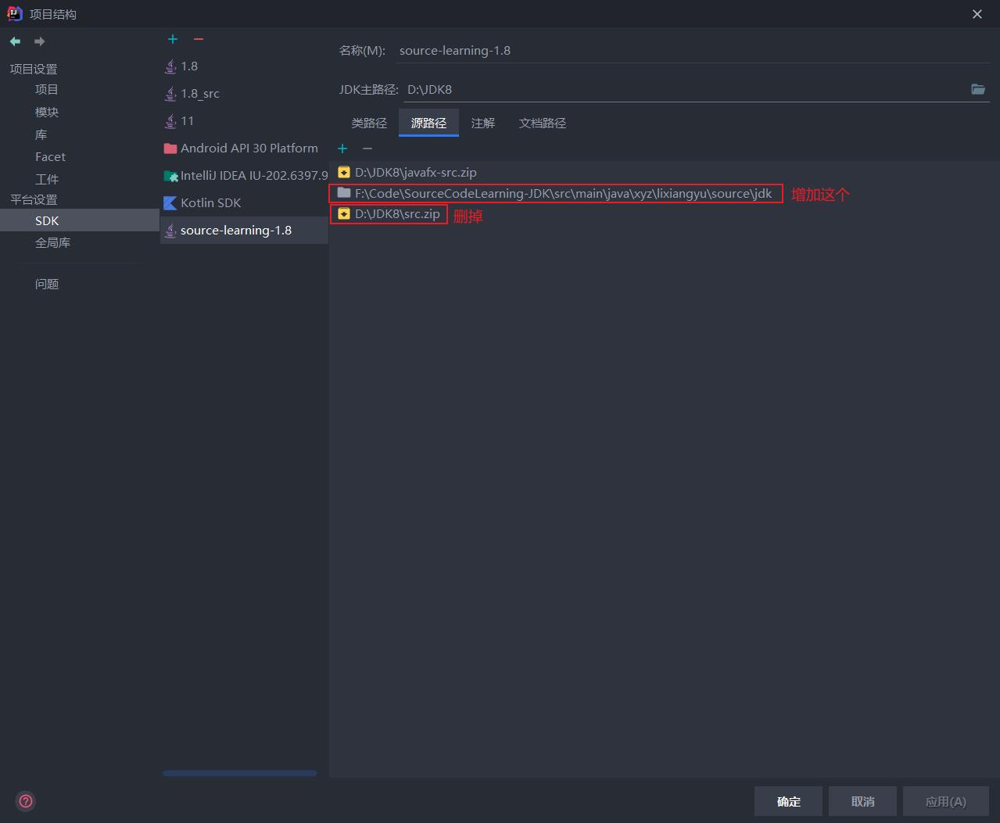
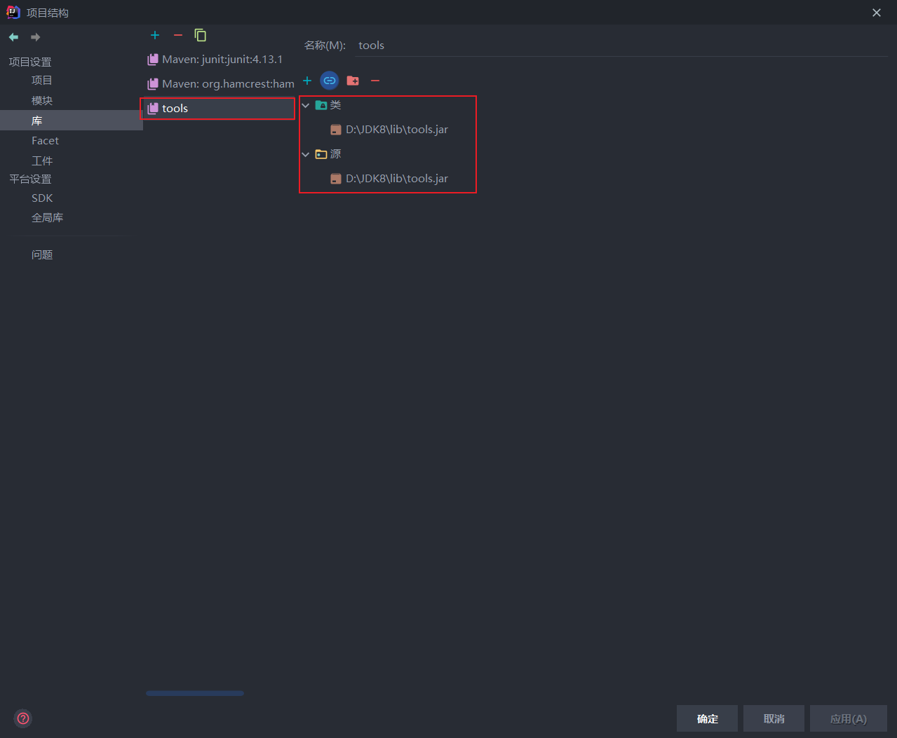
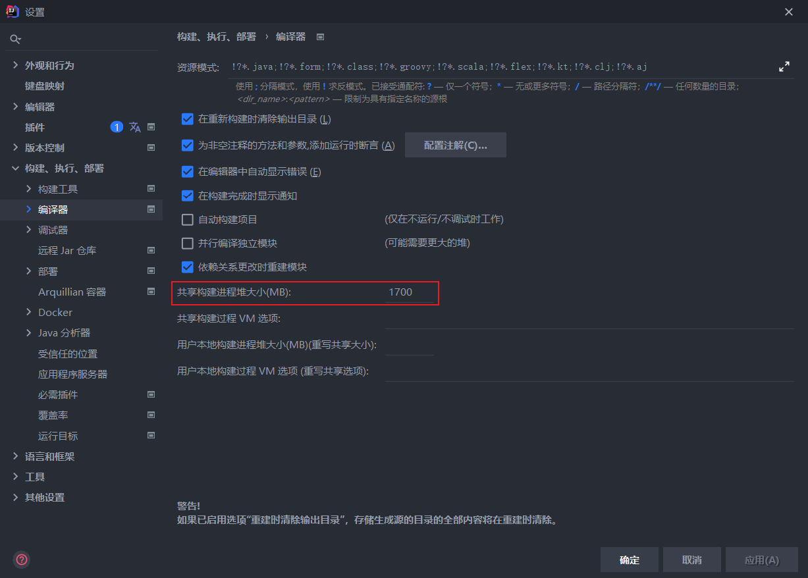
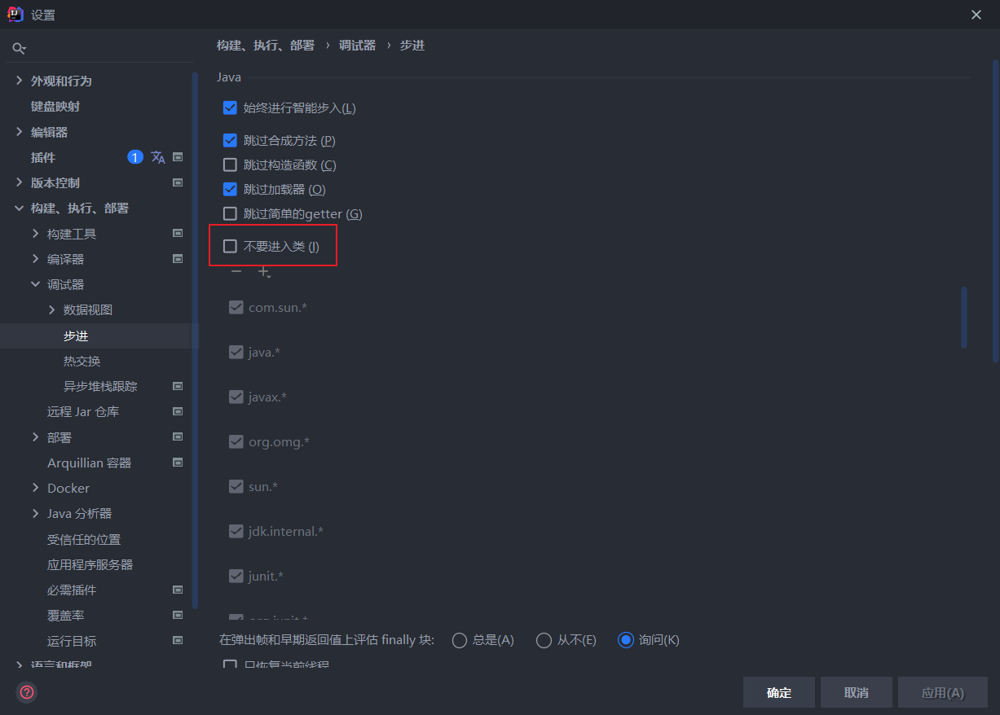
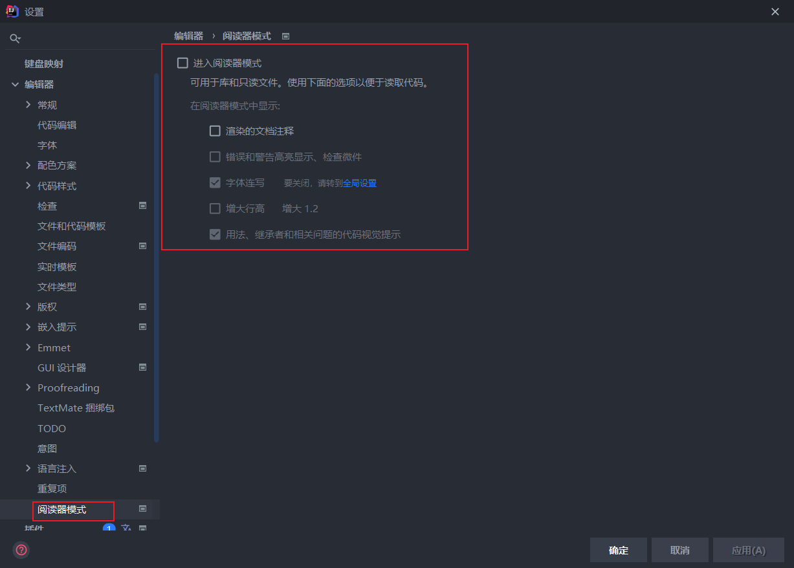
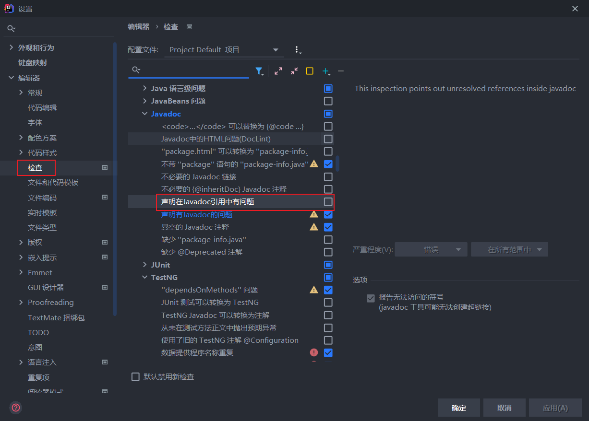
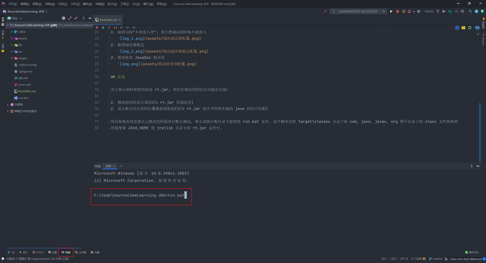

# JDK 源码学习

## 环境

1. windows10 环境
2. Oracle JDK 1.8.0_291

## 在 IDEA 中配置环境

1. 下载 Release 中提供的 [Oracle JDK](https://github.com/lxy1152/SourceCodeLearning-JDK/releases/tag/1.0.0)
2. 在 IDEA 中打开工程
3. 在项目结构中配置 SDK 使用的源路径
   
4. 在项目结构中增加 tools.jar 依赖
   
5. 在设置中修改编译器使用的内存大小
   

## 其他非必要配置

这些修改内容不是必要的, 但也推荐修改一下:

1. 取消勾选"不要进入类", 要不然调试的时候不能进入
   
2. 取消阅读器模式
   
3. 取消检查 JavaDoc 的引用
   

## 注意

由于执行的时候使用的是 rt.jar, 所以在修改代码以后可能会出现:

1. 修改的代码未生效(因为 rt.jar 里面没有)
2. 进入断点以后代码位置都是错乱的(因为 rt.jar 的字节码和本地的 java 代码不匹配)

所以如果真的需要自己修改代码或者打断点调试, 那么请执行根目录下提供的 run.bat 文件. 这个脚本会将 target\classes 目录下的 com, java, javax, org 四个目录下的 class 文件替换到 环境变量
JAVA_HOME 的 jre\lib 目录下的 rt.jar 文件中. 在 IDEA 启动终端, 输入 run.bat 即可(**注意目录必须是项目的根目录**).

